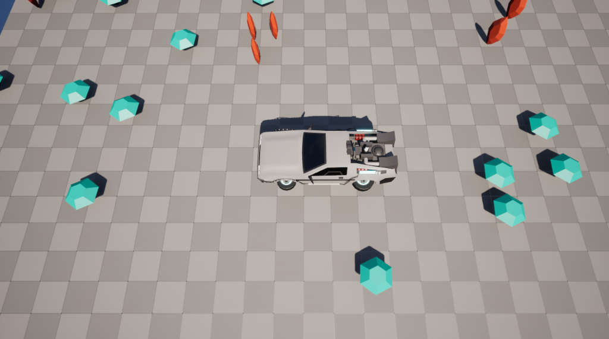

# Beginning Unreal - The Gem Collector

This is an Unreal Engine tutorial project showing how to start working with Blueprints and C++ in a lightweight fashion. The goal is for you to understand absolutely everything in this demo, so no complex components, advanced features, or extra assets are used, only the bare minimum.

## What to look for in this demo?

This is a tutorial code aiming to show you how to work with the following:

- Creating a basic level (without open world)
- Disabling Nanite and Lumen
- Importing assets
- Working with Visual Studio
- Blueprints basic programming
- C++ basic programming
- Blueprint Actor inheriting from C++
- StaticMeshComponent
- Rotation Animation
- Defining default assets from C++
- GameMode configuration.
- Using the EnhancedInputSubsystem from Blueprints
- CameraActor following the player Pawn
- Pawn continuous movement on cardinal directions, defined via an ENUM
- Checking collisiong withoug colliders
- Playing 2D sounds
- Spawning actors from Blueprints
- Using AddOnScreenDebugMessage
- Using UE_LOG on a custom log channel
- Basic performance metrics (video version only)
- Packaging a game (video version only)
- Setting up a git repository for an Unreal Engine project
- Using Git-LFS (video version only)

Much of the content is only explained in the related video, check out: https://www.youtube.com/watch?v=arStJGFIKKg . It is presented in spanish, but you can use subtitles.

## About Git-LFS

To make this repository publicly available on Github, it is not possible to use Git-LFS. Consider renaming .gitattributes_off to .gitattributes and properly setup Git-LFS as explained at https://git-lfs.com/.
You may be required to remove and re-add files with the extension .uasset and .umap.

## Art Credits

The assets used in this demo were handpicked from the following free gorgeous asset packs. My sincere thanks to the original authors!.
- https://designersoup.itch.io/low-poly-car-pack-1
- https://godgoldfear.itch.io/low-poly-gems-pack-2
- https://kronbits.itch.io/freesfx